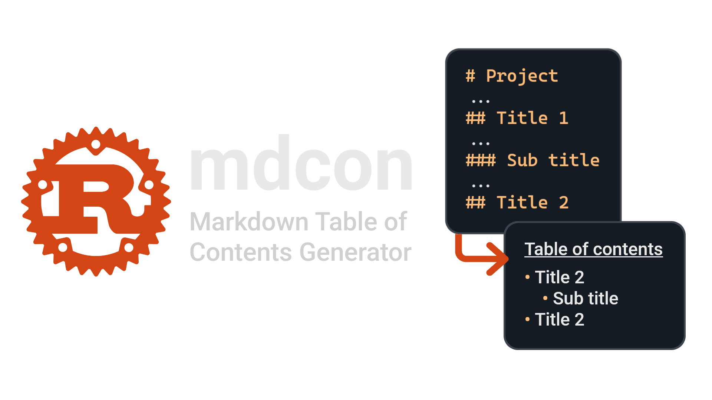

Utility for generating **Table of contents** from Markdown file.

## Table of Contents:

<!-- mdcon-start -->
- [Installation](#installation)
    - [Arch Linux](#arch-linux)
    - [Cargo](#cargo)
    - [Build from source](#build-from-source)
- [Usage](#usage)
- [Detailed description](#detailed-description)
    - [mdcon token](#mdcon-token)
    - [Dumping Table of Contents](#dumping-table-of-contents)
- [Links](#links)
<!-- mdcon-end -->

## Installation

### Arch Linux

If you have Arch Linux, you can install `mdcon` from
[aur](https://aur.archlinux.org/packages/mdcon). When using `yay`, you can do:

```bash
yay -S mdcon-bin
```

### Cargo

Another way to install `mdcon` is via the Rust toolchain (see
[rust installation page](https://www.rust-lang.org/tools/install)). When you
have the Rust Toolchain, you can install the project from source:

```bash
cargo install mdcon
```

### Build from source

You can also build it directly from source. Similar to installing via `cargo`
you need the Rust toolchain:

```bash
git clone https://github.com/Martan03/mdcon
cd mdcon
cargo build -r
```

The binary will be `./target/release/mdcon`.

## Usage

Generates **Table of contents** for `README.md`:

```
./mdcon
```

Generates **Tables of contents** for given file:

```
./mdcon -f file.md
```

You can also check whether the TOC in the file is up to date:

```bash
./mdcon -f file.md -c
```

You can check other usage in help:

```
./mdcon -h
```

## Detailed description

This utility generates **Table of contents** from Markdown file. Each item in
the table consists of the text, which is the text corresponding to the header
text and then the link itself, which redirects to corresponding header.

### mdcon token

You can use special **token** in order to insert the **Table of contents**
into specific location in the file. If no token is provided, **Table of**
**contents** are placed to the beginning of the file.

The token looks like this:

```
{{ mdcon }}
```

You can place it anywhere you want and `mdcon` will generate contents from
headers only after this token. After generating, it will automatically replace
this token with **Table of contents**.

**TOC updates:**

After generating TOC, `mdcon` wraps it in HTML comments marking the beginning
and end. Thanks to these comments `mdcon` is able to regenerate already 
existing TOC, without you having to place a new token inside of the file.

> [!WARNING]
> You have to keep the comments in order to keep this functionality.

#### Example

If we have this markdown:

```markdown
# mdcon test

{{ mdcon }}

## This is a title

bla bla bla

### Sub title

## And so on...

bla bla bla
```

Our file will be modified to this:

```markdown
# mdcon test

<!-- mdcon-start -->
- [This is a title](#this-is-a-title)
    - [Sub title](#sub-title)
- [And so on...](#and-so-on)
<!-- mdcon-end -->

## This is a title

bla bla bla

### Sub title

## And so on...

bla bla bla
```

### Dumping Table of Contents

If you don't want to place **Table of contents** to the file, you can use `-d`
flag to dump the table to `stdout`.

## Links

- **Author:** [Martan03](https://github.com/Martan03)
- **GitHub repository:** [termint](https://github.com/Martan03/mdcon)
- **Author website:** [martan03.github.io](https://martan03.github.io)
